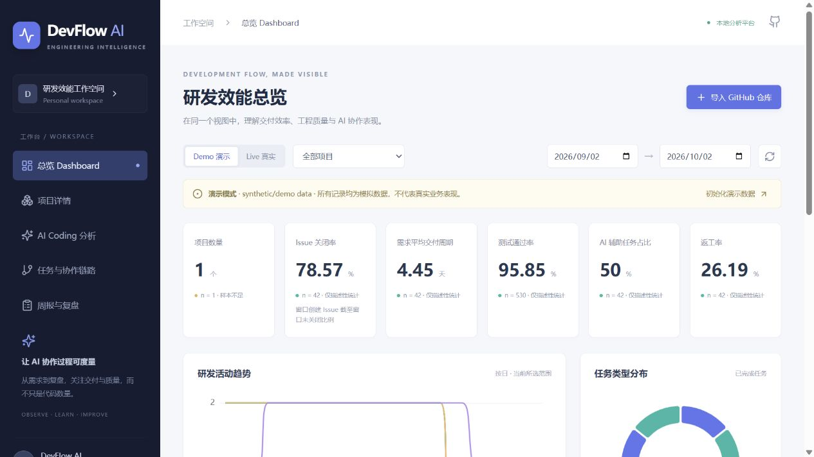
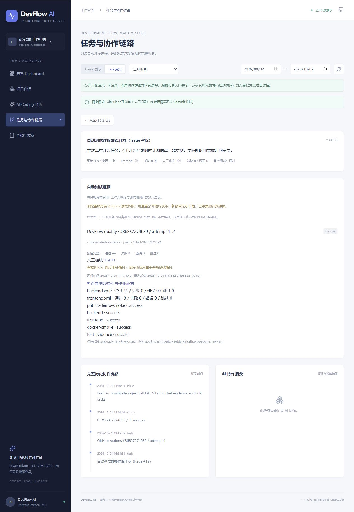
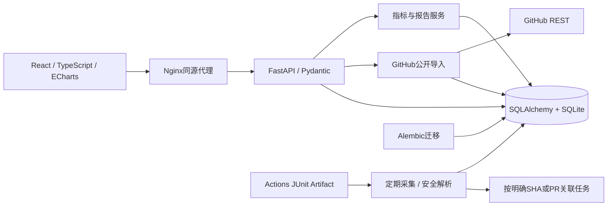

# DevFlow AI

**面向AI辅助开发的研发效能分析平台** · 原创个人作品集项目

**[打开公网只读演示](https://devflow-ai-demo.onrender.com)** · [GitHub Actions](https://github.com/xxu94420-commits/devflow-ai/actions)

支持查看指标、筛选项目与日期、浏览协作链路和下载周报；不接受访客写入。Render免费实例休眠后首次访问可能等待约一分钟。Demo明确标记为模拟数据；Live仓库元数据为启动快照，自动CI采集周期与权限状态在项目详情单独展示。

从“提交了多少代码”转向“需求如何交付、AI参与了什么、验证与返工发生在哪里”。本平台连接GitHub公开研发元数据与人工AI记录，提供有明确样本量、分母和局限的描述性分析，不宣称未经验证的效率提升。



公网版本：[只读部署说明与验收](docs/public-demo-deployment.md)。自动测试链路：[配置、数据口径和真实验证](docs/ci-test-evidence.md)。未配置 GitHub Actions 读取权限时，公网仅展示运行状态，用例数保持未知。

2026-10-02 已上线自动测试证据页：**Live → 项目详情 → devflow-ai → 自动测试证据**。当前每60分钟采集，实例休眠期间暂停；[公网页面截图](docs/screenshots/public-ci-evidence.png)。

<details>
<summary>查看真实 CI 回流截图（本地独立验收库，非公网数据）</summary>



此图为第一阶段真实运行：41 项后端 + 3 项前端测试，共 44 项；不代表当前测试总数。来源运行、采集时间、报告校验值均可追溯。

</details>

## 解决什么问题

- GitHub无法直接回答AI建议是否采纳、人工改了几轮、是否产生返工。
- 简单对比AI/非AI平均耗时可能只是任务复杂度差异。
- Issue、Commit、PR和测试缺陷分散，难以追溯需求到复盘。

DevFlow提供Requirement → Issue → Task → AIInteraction → Commit/PR → TestResult → Defect → Retrospective链路。7种预置任务类型、16项原创指标口径、同类型对比门槛、真实开发案例和ADR共同构成项目核心。

## 功能

| 页面 | 能力 |
| --- | --- |
| 总览 | 交付/质量/AI指标、趋势、任务分布、样本提示 |
| 项目详情 | 仓库来源、趋势、任务、缺陷与返工；Actions运行/重跑、JUnit计数、任务归属与证据链接 |
| AI Coding分析 | 工具/环节分布、AI与非AI均值、按类型样本与时间差 |
| 任务详情 | 需求、Issue、AI、Commit、PR、自动CI/手工测试、缺陷、复盘时间线；本地支持补录与关联 |
| 周报复盘 | 所选窗口与前一等长窗口比较、规则提示、代表案例、Markdown下载 |

## 架构与目录



```text
backend/
  app/             模型、校验、API、指标、GitHub导入、报告、seed
  migrations/      显式数据库版本迁移
  tests/           API、指标边界、导入失败和报告测试
frontend/
  src/             五页工作台、表单、图表、API客户端和测试
  nginx.conf       部署时同源代理
docs/
  adr/             架构决策
  screenshots/     实际页面截图
  issues/          本次GitHub工作单/PR正文留档
scripts/           本仓库维护辅助工具（非运行依赖）
.github/workflows/ CI质量检查与Docker冒烟验证
compose.yaml
```

## 快速启动：Docker

公开只读版本已部署并验收，另提供根目录 `Dockerfile` 和 `render.yaml`。部署步骤、数据来源和免费实例限制见 [公网演示部署说明](docs/public-demo-deployment.md)，[实际公网截图](docs/screenshots/public-demo.png)展示只读入口和数据标记。

需要Docker Engine/Desktop和Compose插件。从仓库根目录执行：

```bash
docker compose up --build -d
docker compose exec api python -m app.seed
```

打开 [Web界面](http://localhost:8080)、[API文档](http://localhost:8000/docs)。也可在Demo页面点击“初始化演示数据”。seed幂等，不覆盖已存在演示记录；默认不会自动导入任何真实仓库。

可选复制`.env.example`为根目录`.env`。`GITHUB_TOKEN`可留空；增加配额时仅在本地.env或部署环境设置。Compose使用`COMPOSE_DATABASE_URL`，本地Python使用`DATABASE_URL`，防止开发路径误覆盖容器持久卷。

默认仅监听本机。`docker compose down`停止但保留数据；不要随意加`-v`，它会删除命名卷。

## 前后端独立启动

要求Python 3.11+（验证使用3.12）、Node.js 24、pnpm 11.19.0。

后端，在根目录创建虚拟环境并安装：

```bash
python -m venv .venv
# Linux/macOS
source .venv/bin/activate
# Windows PowerShell：.\.venv\Scripts\Activate.ps1
pip install -r backend/requirements.txt
cd backend
python -m alembic upgrade head
python -m app.seed
python -m uvicorn app.main:app --reload --host 127.0.0.1 --port 8000
```

第二个终端：

```bash
cd frontend
corepack enable
corepack prepare pnpm@11.19.0 --activate
pnpm install --frozen-lockfile
pnpm dev
```

打开 [开发页面](http://localhost:5173)。默认前端访问`http://localhost:8000`；如需更改，在`frontend/.env`写`VITE_API_URL=...`并重启Vite。后台从根目录.env读取配置，因此Python命令应在backend目录执行。

## 数据来源：Demo与Live

- **Demo**：42个`synthetic/demo data`任务，包含失败测试与返工，均为模拟，不代表企业数据。每任务类型两组各3个，因此不会显示时间节约率。
- **Live / 外部接入验证**：`xxu94420-commits/mbrset-dissertation-code`是用户毕业论文的公开仓库，只用于验证元数据读取；不是本平台业务代码依赖，未修改论文仓库。首次实测3个Commit、无Issue/PR，不补造缺失数据。
- **Live / 本项目开发案例**：`xxu94420-commits/devflow-ai`记录本次真实Issue、功能分支、Commit和PR。是更完整的协作案例；AI使用仍必须人工记录，不能由GitHub自动推断。

界面“导入GitHub仓库”填`owner/name`。API示例：

```bash
curl -X POST http://localhost:8000/api/github/import \
  -H 'Content-Type: application/json' \
  -d '{"repository":"xxu94420-commits/devflow-ai","max_pages":2}'
```

每类最多max_pages×100条，只有前20个PR采集评审和提交明细；触及限制显示覆盖提示。网络失败或限流整轮回滚，重复导入幂等。404、401、429和409均有可读错误。配置DEVFLOW_API_KEY后写操作需要`X-API-Key`，前端表单支持内存中输入该键；它不是GitHubToken。

## 指标与记录

完整定义见[指标字典](docs/metric-dictionary.md)。关键原则：UTC左闭右开窗口、完成任务队列、未知不当0、同类两组各n≥5才显示耗时差，仍不能作因果结论。首轮测试与全部执行通过率分开，返工任务占比与人工修改次数分开。

Swagger提供需求创建/修改、Issue关联、缺陷解决等全部接口；前端提供常用任务、AI交互、测试、缺陷、复盘和Commit/PR关联入口。任务完成必须填写实际工时。没有计时证据时不要为展示效果补造数字。

## 测试与验证

自动测试数据链路见 [CI证据接入说明](docs/ci-test-evidence.md)：CI生成Pytest/Vitest JUnit，按运行ID和attempt幂等采集，只有完整且明确关联任务的报告进入测试指标；跳过不计通过，无权限或缺报告不补造计数。

本地 `.env` 设置 `CI_SYNC_INTERVAL_SECONDS=3600` 可启用每小时轮询；默认0关闭。报告下载需要服务端 `GITHUB_TOKEN` 具有目标仓库 Actions读取权限。公网继续只读，后台采集与访客写接口相互独立；没有Token仍可展示真实运行状态。界面中的“已配置”不代表Token一定有效，实际报告状态为准。

```bash
cd backend
python -m pytest -q
python -m ruff check .
python -m black --check .
python -m alembic upgrade head
python -m alembic check
# 只在空白/测试数据库验证降级，切勿对有业务数据的库随意执行
cd ../frontend
pnpm lint
pnpm test
pnpm build
```

GitHub Actions执行上述检查，并真实构建/启动Compose、检查健康、初始化Demo及查询指标。[首轮全绿CI](https://github.com/xxu94420-commits/devflow-ai/actions/runs/36689990449)。最终执行情况与局限见[验证记录](docs/verification.md)。

## 原创性与开发证据

业务模型、指标字典、任务队列统计口径、样本门槛、页面与文档围绕本项目从零实现，使用FastAPI、SQLAlchemy、React、ECharts等框架，未复制其他看板的完整业务代码。开发按功能拆分，通过真实GitHub Issue、功能分支和Pull Request推进，保留阶段提交、测试失败与修复记录。案例文档记录5个实际AI辅助开发过程；公网部署和自动测试链路的后续证据见开发日志与验证记录。

- [真实AI开发案例（5个）](docs/case-studies.md)
- [开发日志](docs/development-log.md)
- [架构](docs/architecture.md) · [数据字典](docs/data-dictionary.md)
- [AI记录协议](docs/ai-assisted-development-protocol.md) · [隐私与局限](docs/privacy-and-limitations.md)
- [ADR](docs/adr/) · [贡献说明](CONTRIBUTING.md) · [变更日志](CHANGELOG.md)

## 已知限制与后续计划

当前为可运行的作品集MVP，支持本地可编辑工作空间和已上线的公网只读演示。Issue/PR/Commit采用有范围上限的同步导入，公网在启动时读取快照；CI已支持后台定期采集、按运行与attempt幂等存储、证据列表分页和明确的任务关联，但尚无覆盖全部仓库历史的增量同步与批次审计。指标主要在内存中聚合，任务等其他列表尚未分页，也未实现完整事件溯源。

公网免费实例会休眠，使用临时SQLite存储，不适合长期保存真实研发记录。完整JUnit下载需要服务端Actions读取权限，未配置时保留未知计数。PostgreSQL连接已预留，尚未完成专项集成回归；未做规模压测，未实现多用户身份认证或RBAC，也未完成全面安全审计。现有AI/非AI数据不构成人类对照实验，不据此宣称真实提效百分比。

近期优先：验证真实模型调用、完善非技术使用指南并连续积累可核查使用记录。持久化存储与PostgreSQL集成回归暂缓；后续工程方向包括：持久化存储与备份 → 仓库增量同步及批次审计、CI历史补采与多实例协调 → 其他列表分页与SQL聚合 → 需求变更/返工事件流 → PostgreSQL集成测试 → 多用户身份认证和访问隔离 → 在统一记录协议下积累更充分的真实任务样本。

## AI需求质量评估

从“需求质量评估”进入：保存需求 → 明确确认发送给模型 → 阅读带原文引用的问题 → 人工采纳或驳回 → 修订并重新评估 → 创建关联开发任务。未连接模型时仍可管理需求；人工编写的示例明确标注synthetic/demo data。

本地支持服务端配置的兼容云端接口或Ollama；公网项目保持只读，可单独启用不保存访客文本的云端试用。Groq免费套餐的配置、操作步骤、额度边界及六条模拟评测样例见[需求评估使用说明](docs/requirement-review.md)。密钥仅在服务端配置。当前契约与失败路径经过自动测试，真实模型效果尚待配置服务后验证，不宣称准确率。
