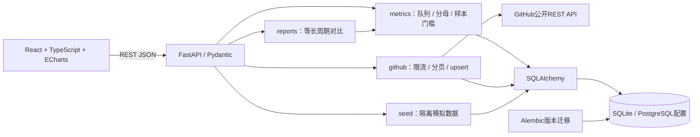
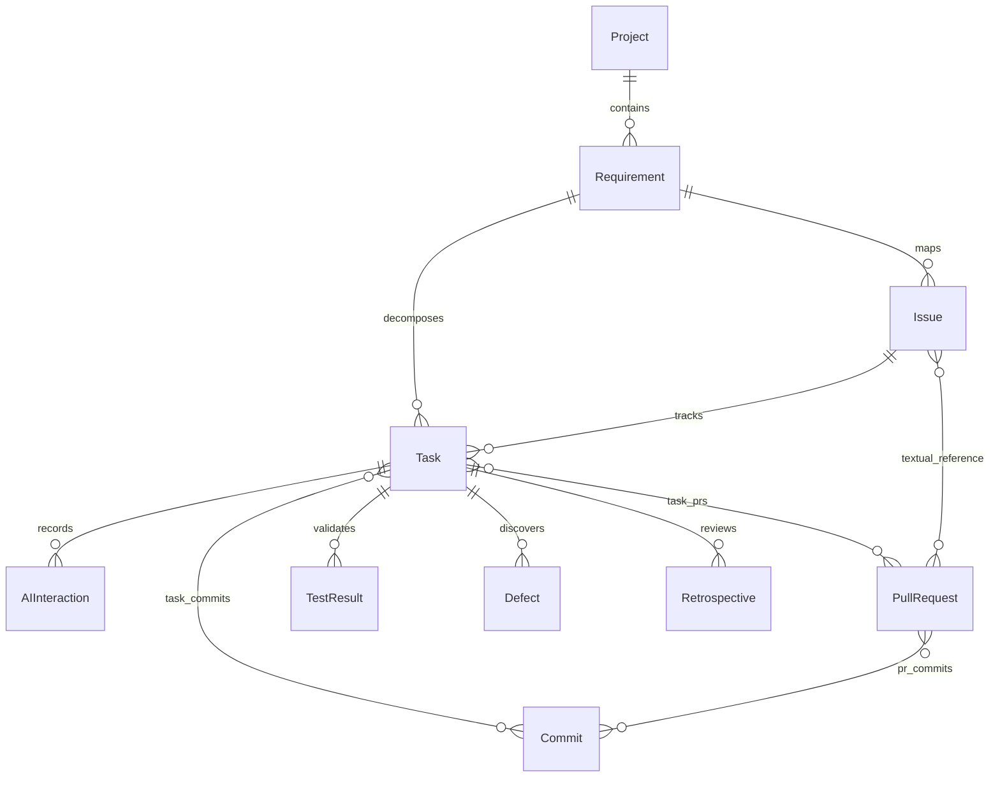

# 系统架构

DevFlow AI采用模块化单体，面向小规模个人/团队研发过程复盘。关系模型和指标队列先于可视化设计，前端不自行计算指标，避免页面口径漂移。

## 运行路径

开发：Vite 5173 → FastAPI 8000，通过环境变量限制CORS。容器：Nginx 8080 → `/backend/api/*` → FastAPI容器8000；命名卷保存SQLite。迁移先运行，API随后启动，健康检查通过后启动前端。

`app/main.py`负责校验、外键归属、序列化与服务编排；`github.py`在同一事务中导入；`metrics.py`定义唯一指标实现；`reports.py`复用指标函数。Pydantic阻止负耗时、非有限数、反向日期和错误计数。SQLAlchemy外键/唯一约束兜底，SQLite打开foreign_keys。

## 边界与扩展

- 未实现多租户、RBAC、SSO、不可变审计、后台队列，默认仅本机绑定。
- 当前分析一次载入项目数据，适合小仓库；下一阶段改SQL聚合、分页和索引基准，未经压测不宣传吞吐性能。
- PostgreSQL驱动与连接串已预留；本轮主要验证SQLite，不声称已通过PostgreSQL回归。
- GitHub导入仅读取公开元数据，不下载源码和附件；人工AI数据必须遵守脱敏协议。
