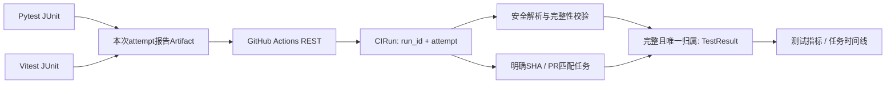

# 自动测试数据链路

## 从CI到任务

CI分别上传 `devflow-part-backend-{attempt}` 与 `devflow-part-frontend-{attempt}`，汇总作业即使测试失败也尝试运行。最终 `devflow-junit-{attempt}` 包含 `manifest.json`、`backend.xml`、`frontend.xml`，保留14天。manifest显式声明预期文件，缺失任一报告标为partial。其他仓库使用相同协议可接入；不是任意第三方artifact的通用猜测解析器。

## 配置与调用

- `CI_SYNC_INTERVAL_SECONDS=0` 默认关闭后台采集；设为300至86400秒启用。公网Blueprint配置3600秒，避免匿名API额度被快速耗尽。
- `GITHUB_TOKEN` 仅存服务端环境。下载artifact需要该仓库 **Actions: read** 权限；未配置时仍读取公开工作流和作业，但用例计数为未知。不要把本机Git凭据传入前端或公网演示。
- `POST /api/ci/sync`：`{"project_id": 1, "max_runs": 3}`，本地立即采集；每次1至5个最新run，每run回溯最多3次attempt，每次最多100个job。不是历史全量同步。
- `GET /api/ci/runs?mode=live&project_id=1&limit=10&offset=0`：查看证据、任务归属、计数和来源链接。
- `GET /api/ci/status`：采集周期与artifact权限是否配置，不返回密钥。
- `PUT /api/ci/runs/{id}/task`：`{"task_id": 1}` 人工确认归属；null恢复自动匹配。受写入权限与公网只读边界保护。
- 项目详情显示自动测试证据；本地提供同步/确认关联，公网仅展示。任务详情显示关联运行及时间线事件。

一个进程最多轮询前3个Live项目。当前适合个人作品集，不能启动多个worker并假定分布式恰好一次；多实例可能遇到唯一约束竞争并回滚，后续需独立队列与分布式锁。单轮设置请求/时间预算，网络异常、限流回滚当前项目事务，保留之前记录。轮询不要求访客刷新触发写操作。

## 统计与关联边界

- passed/failed/errors/skipped按实际testcase计数，忽略可能重复累计的父级tests属性。
- `TestResult.total = passed + failed + errors`，跳过不计通过，不计执行分母。全部跳过或没有可执行用例不生成TestResult。
- 工作流成功不是测试通过；lint/build失败也不是任务缺陷，平台不自动制造Defect。
- 同一(project_id, run_id, attempt)只存一条CIRun，对应至多一条TestResult；不同run_id的push/PR是两次实际执行，不按SHA合并。重新运行的attempt不会覆盖此前失败。
- 自动关联只使用TaskCommit的精确SHA或TaskPR与运行PR编号匹配。唯一候选自动归属，多候选需确认，不按任务标题、时间邻近或AI使用情况推断。
- 未关联的真实用例仍在项目证据列表显示，但不进入任务指标。人工指定任务也不证明该任务造成全部仓库级失败。
- 首次测试通过率仅基于已观测数据；若某任务有更早且证据未知的已关联CI，该任务不进入首次通过率，详情显示未知。
- 无报告、过期、未授权、格式错误和未完成分开显示。成功解析后只保存计数、文件名和SHA256，artifact过期后仍保留当时证据摘要。

## 安全与隐私

API固定指向GitHub；不接受任意artifact URL。下载302跳转仅允许HTTPS GitHub/Azure artifact域，使用独立无Authorization客户端。ZIP最多2MiB，展开最多8MiB和25文件，禁止目录路径/加密/重复文件；XML禁止DTD和实体。不持久保存原始XML、测试输出、失败堆栈或带签名下载链接。

JUnit源报告本身可能包含测试路径和输出，上传前仓库维护者应保证测试不打印密钥。本项目CI仅使用公开fixture，不能将此协议视为任意业务报告已自动脱敏。

## 已执行的真实验证

第一阶段commit `b36307f` 的 [run 36857274639](https://github.com/xxu94420-commits/devflow-ai/actions/runs/36857274639) 产出真实报告：41个后端测试 + 3个前端测试，合计44通过。报告SHA256：`b644af2cccc6a673fdb0a27f372a295e0b2a49bb1e1b3fbea5995b5301ce7312`。

`scripts/verify_ci_roundtrip.py` 使用维护者现有Git凭据（仅内存）读取本仓库，在独立 `backend/data/ci-verification.db` 记录真实开发任务并明确归属这次运行。重复同步验证TestResult仍只有1条。任务4小时仅为计划估算，实际耗时和完成时间未伪造；数据库不上传。

离线Mock测试另覆盖失败、错误、跳过、缺报告、过期、无权限、重复同步、attempt重跑、歧义及跨项目关联、恶意XML/ZIP和网络限流。这些fixture均不是线上效率证据。

GitHub官方接口：[运行](https://docs.github.com/en/rest/actions/workflow-runs)、[作业](https://docs.github.com/en/rest/actions/workflow-jobs)、[artifact与下载权限](https://docs.github.com/en/rest/actions/artifacts)。
